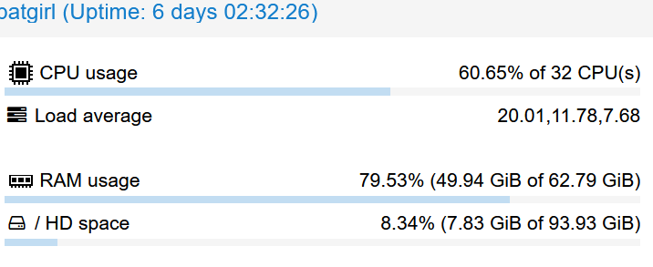
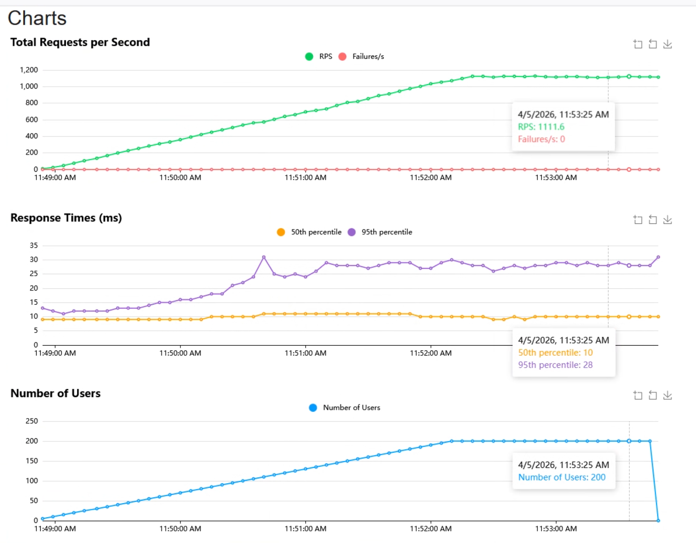

# GitRev

A production-oriented backend that stays predictable under load, recovers cleanly from failure, and is easy to validate before deployment.

## Project Story

### Inspiration
We kept running into the same production problems that break real services: schema drift, bad seed data, brittle deployments, and load tests that exposed weak points only after the system was already under pressure. GitRev was built to practice production engineering, not just ship endpoints.

### What it does
GitRev provides a small but complete API surface for users, short URLs, and events, plus health checks, redirects, seeded data, and the operational guardrails needed to keep the service observable and recoverable.

### How we built it
We used Flask and Peewee on PostgreSQL, wrapped the app in Docker, deployed with Helm, and validated behavior with unit, integration, and load tests. We also added deterministic seeding, sequence recovery, and test fixtures so the application can be reset and exercised repeatably in both local and cluster environments.

### Challenges we ran into
The hard parts were operational, not just functional. We had to fix sequence drift, make seed data happen only in the right environments, make integration tests work against a realistic database state, and handle Locust runs that hit DNS and CPU limits before the API itself failed. Load testing also exposed that POST /users was the primary bottleneck under heavy concurrency.

### Accomplishments we’re proud of
We shipped a backend that stays up through seeded baselines, integration coverage, and load-test validation. The project now has a real reliability story: health checks pass, redirects work, events stay responsive, and the system keeps serving traffic even when one path becomes the bottleneck.

### What we learned
Production reliability is rarely about one big bug. It is usually about many small things working together: correct hostnames, predictable seed data, stable database sequences, connection limits, and tests that reflect real operational behavior.

### What’s next for GitRev
Better observability, distributed Locust runs for higher load, caching for the hottest read paths, and stronger failover behavior so the system can surface problems earlier instead of simply surviving them later.

**Tech Stack:**      

**Deployment:** 

**CI Status:** [](https://codecov.io/gh/nic5694/PaneraBreadWarriors)
[](https://github.com/nic5694/PaneraBreadWarriors/actions/workflows/python_ci.yml)
[](https://github.com/nic5694/PaneraBreadWarriors/actions/workflows/python_ci.yml)


Track #1 Reliability
Track #2 Scalability
Track #3 Incident Response

## Prerequisites

- **uv** — a fast Python package manager that handles Python versions, virtual environments, and dependencies automatically.
  Install it with:
  ```bash
  # macOS / Linux
  curl -LsSf https://astral.sh/uv/install.sh | sh

  # Windows (PowerShell)
  powershell -ExecutionPolicy ByPass -c "irm https://astral.sh/uv/install.ps1 | iex"
  ```
  For other methods see the [uv installation docs](https://docs.astral.sh/uv/getting-started/installation/).
- PostgreSQL running locally (you can use Docker or a local instance)

## uv Basics

`uv` manages your Python version, virtual environment, and dependencies automatically — no manual `python -m venv` needed.

| Command | What it does |
|---------|--------------|
| `uv sync` | Install all dependencies (creates `.venv` automatically) |
| `uv run <script>` | Run a script using the project's virtual environment |
| `uv add <package>` | Add a new dependency |
| `uv remove <package>` | Remove a dependency |

## Quick Start

```bash
# 1. Clone the repo
git clone https://github.com/nic5694/PaneraBreadWarriors

# 2. Install dependencies
uv sync

# 4. Run the docker compose setup to startup the reddis, database and API
docker-compose up --build

# 6. Verify
curl http://localhost:5000/health
# → {"status":"ok"}
```

## Reset For Load Tests 

We have had issues when running load tests that the database gets into a bad state after a run, with sequence drift and bad seed data. To fix this, we have a Kubernetes Job that can be run to clear persisted rows and reseed the cluster database before a stress run. The Job is suspended by default so it won't run accidentally, but you can resume it with the following command:

```bash
kubectl apply -f helm/reset-load-test-job.yaml
kubectl wait --for=condition=complete job/reset-load-test-data --timeout=120s
```

## Project Structure

```
PaneraBreadWarriors/
├── app/
│   ├── __init__.py          # App factory (create_app)
│   ├── database.py          # DatabaseProxy, BaseModel, connection hooks
│   ├── models/
│   │   └── __init__.py      # Import models here
│   └── routes/
│       └── __init__.py      # register_routes() — add blueprints here
├── docs/
│   └── API.md               # API endpoint documentation
├── helm/                    # Helm charts for deployment
├── screenshots/             # Screeshots and Logo
├── seed/                    # Database seed files
├── tests/                   # Unit and integration tests
├── .env.example
├── quest_log.md             # Hackathon progress log
├── run.py
└── README.md
```

# Docs
- `Docs/API.md` All endpoint documentation.
  HTTP Methods on Health, Users, Urls, and Events.
   
- `Docs/Reliability.md` Track Documentation.
  Reliability testing on integration and unit tests.
  Milestones (Bronze, Silver, or Gold Tiers)
  Completed Gold Tier

- `Docs/Scalability.md` Track Documentation.
  Scalability Testing to ensure that the application is scaling.
  Milestones (Bronze, Silver, or Gold Tiers)
  Completed Bronze Tier

- `Docs/IncidentResponse.md` Track Documentation.
  Failure testing documentation so that when server goes down, incidents can be resolved.
  Milestones (Bronze, Silver, or Gold Tiers)

## Quest Log of Our Progress

This document serves as a comprehensive log of our journey through the Reliability and Scalability quests. It provides an overview of the objectives, results, and verification for each tier of both quests, along with links to detailed documentation for each.

## Reliability Quest

Overview of the reliability achieved and link to the deep dive of all the 3 tiers implemented:

[reliability](./docs/Reliability.md)

## Scalability Quest

Overview of the Scalability achieved and link to the deep dive of all the 3 tiers implemented:

[scalability](./docs/Scalability.md)

## Incident Response Quest

Overview of the Incident Response achieved and link to the deep dive of all the 3 tiers implemented:

[incident response](./docs/IncidentResponse.md)

## Architecture Diagram


### How It Works

- The GitOps repo is the source of truth for cluster state.
- The GitOps operator repo, [gitops-operators-hackathon-meta](https://github.com/nic5694/gitops-operators-hackathon-meta), installs and manages the Argo CD and MetalLB operators for the cluster.
- That operator repo also creates the Argo CD Application that points at this repository's [./helm](./helm) folder.
- Argo CD continuously reconciles the Helm manifests into the Kubernetes cluster.
- MetalLB assigns the external IP that exposes Traefik.
- Traefik is the cluster ingress controller, routes traffic to the API Service, and the Service points to the API Deployment.
- The API is reachable at `api.homelab` through the [Ingress manifest](./helm/api-ingress.yaml).
- Deployments are tag-driven, so when the `prd` tag changes, the workload rolls forward from the updated image reference.
- The API deployment, service, ingress, PostgreSQL, and Redis resources are all managed from the Helm manifests in this repo.

# Team
- Nic Martoccia
- Han Lee
- Luciano Scarpaci
- Dylan Brassard

# screenshots




# Demo
https://youtu.be/DaYzd9Q0o4g?si=uLD6lfFKjFQUdPnz
