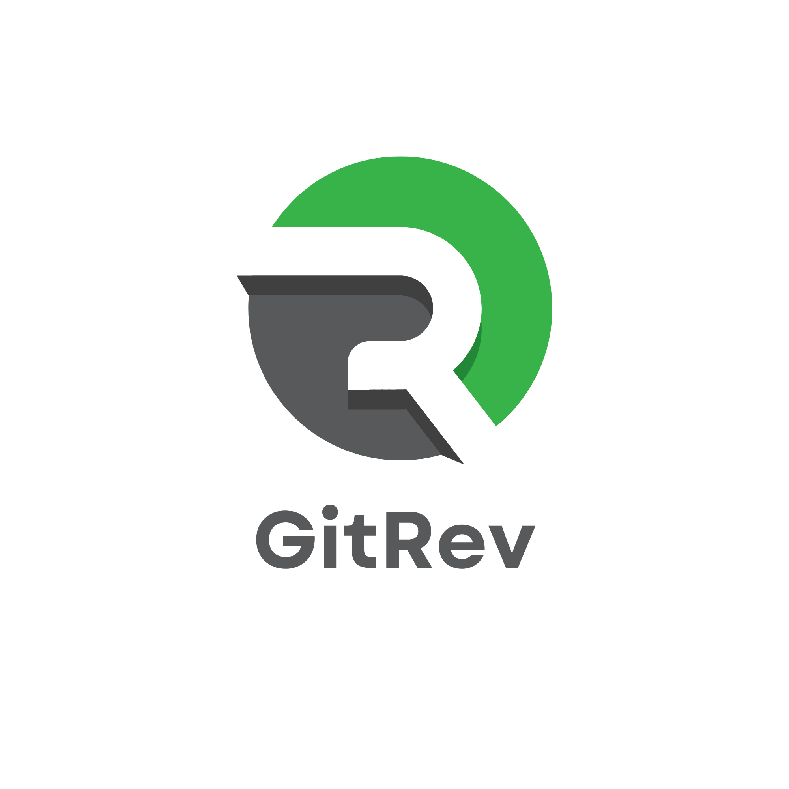
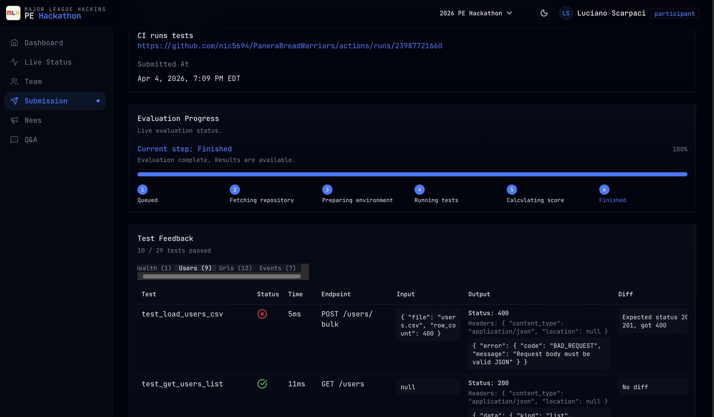
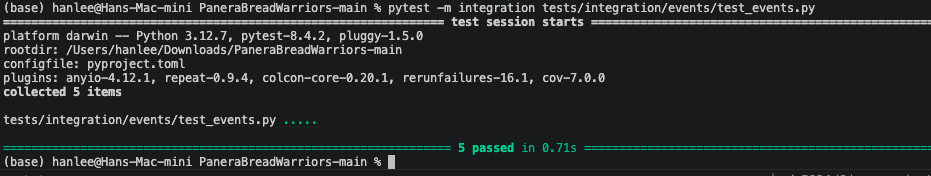

# GitRev

A resilient backend service that stays running.

**Tech Stack:**      

**Deployment:** 

**CI Status:** [](https://codecov.io/gh/nic5694/PaneraBreadWarriors)
[](https://github.com/nic5694/PaneraBreadWarriors/actions/workflows/python_ci.yml)
[](https://github.com/nic5694/PaneraBreadWarriors/actions/workflows/python_ci.yml)



Track #1 Reliability
Track #2 Scalability
Track #3 Incident Response

## Prerequisites

- **uv** — a fast Python package manager that handles Python versions, virtual environments, and dependencies automatically.
  Install it with:
  ```bash
  # macOS / Linux
  curl -LsSf https://astral.sh/uv/install.sh | sh

  # Windows (PowerShell)
  powershell -ExecutionPolicy ByPass -c "irm https://astral.sh/uv/install.ps1 | iex"
  ```
  For other methods see the [uv installation docs](https://docs.astral.sh/uv/getting-started/installation/).
- PostgreSQL running locally (you can use Docker or a local instance)

## uv Basics

`uv` manages your Python version, virtual environment, and dependencies automatically — no manual `python -m venv` needed.

| Command | What it does |
|---------|--------------|
| `uv sync` | Install all dependencies (creates `.venv` automatically) |
| `uv run <script>` | Run a script using the project's virtual environment |
| `uv add <package>` | Add a new dependency |
| `uv remove <package>` | Remove a dependency |

## Quick Start

```bash
# 1. Clone the repo
git clone <repo-url> && cd mlh-pe-hackathon

# 2. Install dependencies
uv sync

# 3. Create the database
createdb hackathon_db

# 4. Configure environment
cp .env.example .env   # edit if your DB credentials differ

# 5. Run the server
uv run run.py

# 6. Verify
curl http://localhost:5000/health
# → {"status":"ok"}
```

## Reset For Load Tests

Use this before a stress run if you want to clear persisted rows and reseed the cluster database with a Kubernetes Job:

```bash
kubectl apply -f helm/reset-load-test-job.yaml
kubectl wait --for=condition=complete job/reset-load-test-data --timeout=120s
```

If you want to rerun the job, delete the previous one first:

```bash
kubectl delete job reset-load-test-data --ignore-not-found
kubectl apply -f helm/reset-load-test-job.yaml
```

## Project Structure

```
PaneraBreadWarriors/
├── app/
│   ├── __init__.py          # App factory (create_app)
│   ├── database.py          # DatabaseProxy, BaseModel, connection hooks
│   ├── models/
│   │   └── __init__.py      # Import models here
│   └── routes/
│       └── __init__.py      # register_routes() — add blueprints here
├── docs/
│   └── API.md               # API endpoint documentation
├── helm/                    # Helm charts for deployment
├── screenshots/             # Screeshots and Logo
├── seed/                    # Database seed files
├── tests/                   # Unit and integration tests
├── .env.example
├── quest_log.md             # Hackathon progress log
├── run.py
└── README.md
```

# API Docs
See `Docs/API.md` for full endpoint documentation.

# Team
- Nic Martoccia
- Han Lee
- Luciano Scarpaci
- Dylan Brassard
# screenshots


# Demo
https://youtu.be/ryN-CXHXBS8
