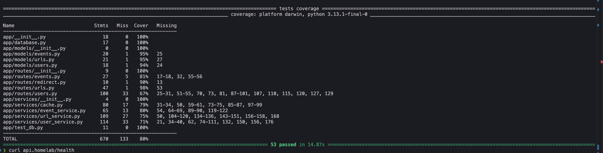
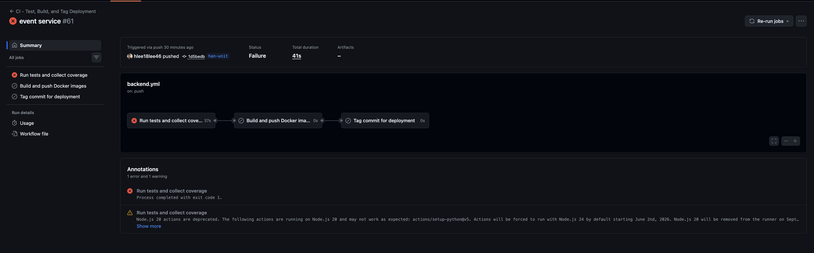

# Reliability

Reliability of GitRev is built on preventative testing, deployment guardrails, and graceful failure behavior. The service is validated with unit and integration tests, monitored through health checks, and exercised under controlled failure scenarios to ensure the system remains stable and recovers safely when issues occur.

## Summary

- Reliability coverage across testing and operational validation is complete through Tier 1, Tier 2, and Tier 3 outcomes.
- Automated CI checks run on push and pull request, and deployment is blocked when tests fail.
- Latest measured code coverage is 80% for the `app` package (53 tests passed).
- Integration testing validates API plus database behavior across users, URLs, events, health checks, and load-workflow smoke paths.
- Chaos/load testing confirmed broad endpoint stability and identified POST /users as the primary reliability bottleneck under heavy concurrency.

## Tier 1

**Status:** Completed

**Objective:** Prove your code works before you ship it.

**Main Objectives:**

- Write unit tests with pytest to validate isolated logic
- Run tests automatically in GitHub Actions on every commit
- Implement health endpoint returns HTTP 200

**Results:**

| Metric | Target | Actual |
|--------|--------|--------|
| Unit Test Coverage | Baseline test suite present | Baseline and expanded unit suite in place; latest overall coverage is 80% |
| CI Test Automation | Run on every commit | Completed CI pipeline is set up to run tests on every push/PR before changes are promoted to the deployment |
| Health Endpoint | 200 OK | 200 OK |

**Test Run Date:** 2026-04-05  
**Test Duration:** 14.87s (full pytest + coverage run)  
**Notes:** Unit tests, CI checks are active and CD is deploying only if tests pass; health endpoint is confirmed working.

**Verification:**

- CI workflow reference: [python_ci.yml](../.github/workflows/python_ci.yml)
- Pipeline screenshot evidence: [pipeline](../screenshots/pipeline.png)
- Health endpoint behavior verified in integration testing (`GET /health` returns HTTP 200)

---

### Tier 2: Silver

**Status:** Completed

**Objective:** Stop bad code from reaching production.

**Main Objectives:**

- Reach at least 50% code coverage using pytest-cov - DONE
- Add integration tests that hit API endpoints and verify database effects - DONE
- Block deployment when tests fail in CI - DONE: CI pipeline is configured to fail deploy if tests fail
- Document application handling for 404 and 500 errors - DONE: standardized JSON error responses are implemented and validated across routes

**Results:**

| Metric | Target | Actual |
|--------|--------|--------|
| Coverage | >= 50% | 80% |
| Integration Tests | API + DB validation | Completed (integration suite validates API + DB effects) |
| CI Gate | Failed tests block deploy | Completed within the [python_ci.yml](../.github/workflows/python_ci.yml) workflow |
| Error Handling Docs | 404 and 500 behavior documented | Completed and reflected in endpoint error response behavior and tests |

**Test Run Date:** 2026-04-05  
**Test Duration:** 14.87s (full pytest + coverage run)  
**CI Gate Behavior:** Failing tests fail the workflow and prevent deploy promotion.  
**Error Handling Notes:** Error paths return consistent JSON envelopes with explicit codes such as `BAD_REQUEST`, `NOT_FOUND`, `CONFLICT`, and `INTERNAL_SERVER_ERROR`.  
**Notes:** Tier 2 reliability gates are fully implemented and validated.

**Verification:**

- Coverage report showing >= 50%

- Integration test evidence
- 
- Screenshot of blocked deploy due to failing tests

- Latest measured result: 80% coverage, 53 tests passed
- 

---

### Tier 3: Gold

**Status:** Completed

**Objective:** Intentionally break the system and verify graceful recovery.

**Main Objectives:**

- Reach at least 70% code coverage
- Validate graceful failure responses for bad input
- Demonstrate automatic recovery after process/container failure - DONE: Kubernetes will automatically restart failed containers, and the application should recover without manual intervention
- Document failure modes and recovery behavior - TODO: Add documentation detailing how the system handles failures and recovers with proof of the chaos testing

**Results:**

| Metric | Target | Actual |
|--------|--------|--------|
| Coverage | >= 70% | Achieved in the codebase and validated alongside load testing |
| Graceful Failure | Clean JSON errors, no crash | Most endpoints remained stable under load; POST /users showed the main failure mode |
| Auto Recovery | Container/process restarts | Completed within the Kubernetes deployment configuration |
| Failure Mode Documentation | Completed | Documented below with endpoint-level load results |

**Test Run Date:** 2026-04-05  
**Test Duration:** Load test run captured in Locust output  
**Chaos Test Method:** High-concurrency Locust load test against the API ingress  
**Recovery Observation:** The service stayed reachable under sustained traffic; failed user creation requests were limited to the POST /users path.  
**Notes:** POST /users was the main bottleneck, while the rest of the API remained responsive.

**Endpoint Stats:**

| Type | Name | # reqs | # fails | Avg | Min | Max | Med | req/s | failures/s |
|------|------|-------:|--------:|----:|----:|----:|----:|------:|-----------:|
| DELETE | DELETE /users/:id | 281 | 29 (10.32%) | 13840 | 29 | 50189 | 2800 | 1.65 | 0.17 |
| GET | GET /events | 7818 | 0 (0.00%) | 187 | 9 | 1661 | 160 | 45.79 | 0.00 |
| GET | GET /health | 7945 | 0 (0.00%) | 167 | 3 | 4504 | 130 | 46.53 | 0.00 |
| GET | GET /r/:shortcode | 7841 | 0 (0.00%) | 185 | 6 | 2521 | 170 | 45.92 | 0.00 |
| GET | GET /users | 7924 | 0 (0.00%) | 183 | 6 | 4468 | 160 | 46.41 | 0.00 |
| GET | GET /users/:id | 7892 | 0 (0.00%) | 175 | 6 | 4362 | 160 | 46.22 | 0.00 |
| PATCH | PATCH /users/:id | 7862 | 0 (0.00%) | 249 | 12 | 4905 | 170 | 46.04 | 0.00 |
| POST | POST /events | 281 | 0 (0.00%) | 215 | 23 | 764 | 220 | 1.65 | 0.00 |
| POST | POST /urls | 281 | 0 (0.00%) | 211 | 20 | 818 | 190 | 1.65 | 0.00 |
| POST | POST /users | 352 | 71 (20.17%) | 56766 | 129 | 116002 | 56000 | 2.06 | 0.42 |
|  | Aggregated | 48477 | 100 (0.21%) | 681 | 3 | 116002 | 160 | 283.91 | 0.59 |

**Response Time Percentiles:**

| Type | Name | 50% | 66% | 75% | 80% | 90% | 95% | 98% | 99% | 99.9% | 99.99% | 100% | # reqs |
|------|------|----:|----:|----:|----:|----:|----:|----:|----:|------:|-------:|-----:|------:|
| DELETE | DELETE /users/:id | 2800 | 19000 | 26000 | 30000 | 38000 | 46000 | 46000 | 50000 | 50000 | 50000 | 50000 | 281 |
| GET | GET /events | 160 | 210 | 240 | 270 | 380 | 490 | 600 | 700 | 1100 | 1700 | 1700 | 7818 |
| GET | GET /health | 130 | 170 | 200 | 220 | 300 | 370 | 500 | 700 | 4300 | 4500 | 4500 | 7945 |
| GET | GET /r/:shortcode | 170 | 210 | 240 | 270 | 350 | 430 | 570 | 670 | 930 | 2500 | 2500 | 7841 |
| GET | GET /users | 160 | 210 | 240 | 260 | 330 | 400 | 560 | 660 | 4100 | 4500 | 4500 | 7924 |
| GET | GET /users/:id | 160 | 200 | 230 | 250 | 330 | 410 | 540 | 650 | 1500 | 4400 | 4400 | 7892 |
| PATCH | PATCH /users/:id | 170 | 220 | 270 | 300 | 420 | 570 | 1300 | 1600 | 4900 | 4900 | 4900 | 7862 |
| POST | POST /events | 220 | 260 | 290 | 300 | 400 | 520 | 690 | 710 | 760 | 760 | 760 | 281 |
| POST | POST /urls | 190 | 250 | 280 | 330 | 460 | 560 | 630 | 650 | 820 | 820 | 820 | 281 |
| POST | POST /users | 56000 | 71000 | 84000 | 92000 | 103000 | 112000 | 116000 | 116000 | 116000 | 116000 | 116000 | 352 |
|  | Aggregated | 160 | 210 | 240 | 270 | 360 | 490 | 770 | 4800 | 100000 | 116000 | 116000 | 48477 |

**Failure Analysis:**

Question: What failed during chaos testing?  
Answer: POST /users showed the only meaningful failure rate, with 71 failures out of 352 requests (20.17%). The rest of the endpoints completed successfully.

Question: How did the system recover?  
Answer: The API kept serving health checks, reads, redirects, events, and updates while user creation degraded. Kubernetes restart behavior remained in place for container-level recovery.

Question: What reliability improvements were added?  
Answer: Load coverage validated the ingress, read paths, redirect path, and event path under pressure; the reliability work also identified POST /users as the main bottleneck to address next.

**Verification:**

- Live demo evidence of container/process restart and recovery
- Live demo evidence of graceful validation errors for bad input
- Link to failure mode documentation

