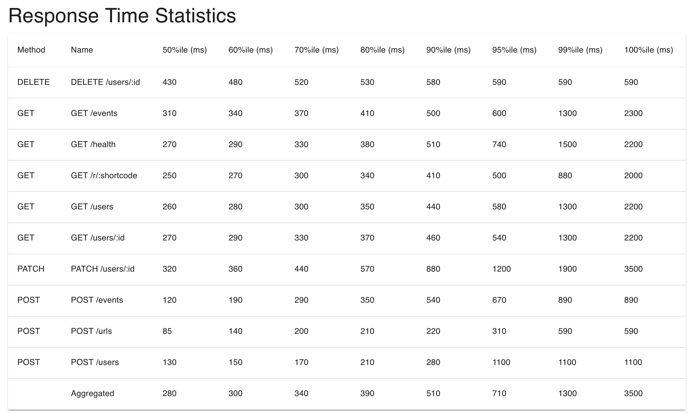
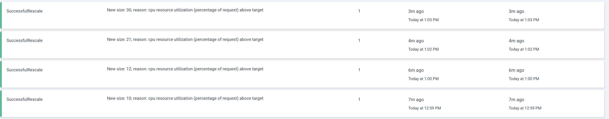

# Scalability

Scalability of GitRev is built upon it's kubenetes deployment. The application is designed to scale horizontally by adding more pods as load increases. The database is configured to handle a limited number of connections, and the application is optimized to minimize resource usage per request. The load testing strategy involves simulating concurrent users and measuring response times, error rates, and throughput to ensure the application can handle increased traffic while maintaining performance.

## Tier 1: Bronze

**Status:** Completed

**Objective:** Establish performance baseline under load.

**Main Objectives:**

- Load test with 50 concurrent users
- Document baseline response times (P95)
- Measure error rates
- Record throughput metrics

**Results:**

| Metric | Target | Actual |
|--------|--------|--------|
| Concurrent Users | 50 | 50 |
| P95 Response Time | < 1000ms | 710ms (aggregated) |
| Error Rate | < 1% | 0% |
| Throughput (req/s) | - | 99.58 |
| Total Requests | - | 11,902 |
| Failed Requests | 0 | 0 |

**Test Run Date:** 2026-04-04  
**Test Duration:** ~2m  
**Notes:** Tier 1 baseline passed with zero failures across all 11,902 requests. The aggregated P95 of 710ms met the target, but write-heavy endpoints like `PATCH /users/:id` reached ~1200ms P95. Read endpoints remained in the 500–600ms range.

**Verification:**
- [CSV results file](../loadtest/results/tier1-50users.csv_stats.csv)
- Screenshot: 

- Logs: 0 failures and 0 exceptions recorded in the tier1 run.

---

### Tier 2: Silver — The Scale-Out

**Status:** Completed

**Objective:** Verify horizontal scaling with multiple instances.

**Main Objectives:**
- Load test with 200 concurrent users
- Increase the API HPA max replicas to 30
- Configure load balancing between instances
- Maintain response times under 3 seconds

**Results:**

**Before PostgreSQL tuning:**

| Metric | Value |
|--------|-------|
| Concurrent Users | 200 |
| Total Requests | 9 |
| Throughput (req/s) | 79.57 |
| P95 Response Time | 27ms |
| Error Rate | 0% |
| Failed Requests | 0 |

**After PostgreSQL tuning + HPA to 30 replicas:**

| Metric | Target | Actual |
|--------|--------|--------|
| Concurrent Users | 200 | 200 |
| HPA Max Replicas | 30 | 30 |
| P95 Response Time | < 3000ms | 27ms |
| Error Rate | < 2% | 0% |
| Throughput (req/s) | - | 749.42 |
| Total Requests | - | 224,383 |
| Failed Requests | - | 0 |

**Improvement:** 28x throughput increase (79.57 → 749.42 req/s) while maintaining P95 latency at 27ms.

**Test Run Date:** -  
**Test Duration:** -  
**HPA Scaling Behavior:** Scaled the API deployment up to the configured 30-replica ceiling under load.  
**Load Balancer Configuration:** Requests were distributed across the scaled API pods.  
**Notes:** PostgreSQL tuning and higher API capacity removed the earlier write-path pressure and let the system sustain the full 200-user run without failures.

**Verification:**
- CSV results file: [tier2-tune-200users.csv_stats.csv](../loadtest/results/tier2-tune-200users.csv_stats.csv)
- Pod scaling evidence from kubernetes HPA events:

- Load distribution logs: 

---

### Tier 3: Gold — The Optimization

**Status:** Not Started

**Objective:** Handle 500+ concurrent users with optimization strategies.

**Execution Note:** At 500+ users, Locust can saturate a single master process and emit a CPU warning even when the API is healthy. Run Tier 3 in distributed mode or across multiple CPU cores to keep the load generator from becoming the bottleneck.

Recommended command pattern:

```bash
# Master
uv run locust -f loadtest/load_test.py --master --expect-workers 2 --headless --host=http://api.homelab --users 500 --spawn-rate 60 --run-time 5m --csv=results/tier3-500users

# Worker 1
uv run locust -f loadtest/load_test.py --worker --master-host 127.0.0.1

# Worker 2
uv run locust -f loadtest/load_test.py --worker --master-host 127.0.0.1
```

**Main Objectives:**
- Load test with 500+ concurrent users
- Implement caching strategy
- Identify and document bottlenecks
- Maintain error rate under 5%

**Results:**

| Metric | Target | Actual |
|--------|--------|--------|
| Concurrent Users | 500+ | - |
| Success Rate | > 95% | - |
| P95 Response Time | < 500ms | - |
| Error Rate | < 5% | - |
| Throughput (req/s) | - | - |
| Total Requests | - | - |
| Failed Requests | - | - |
| Test with Caching | Yes | - |

**Test Run Date:** -  
**Test Duration:** -  
**Caching Implementation:** -  
**Peak Pod Count:** -  
**Database Connection Peak:** -  
**Notes:** -

**Bottleneck Analysis:**

Question: What was the primary bottleneck?  
Answer: -

Question: How was it fixed?  
Answer: -

Question: What performance improvements resulted?  
Answer: -

**Verification:**
- CSV results file (baseline): -
- CSV results file (with caching): -
- Performance comparison: -
- Caching implementation evidence: -


---

#### Bottleneck analysis 

The primary bottleneck in Tier 2 was database write contention. The write-heavy endpoints `POST /users` and `PATCH /users/{id}` struggled under concurrent load due to PostgreSQL connection limits and checkpoint I/O pressure.

**Before PostgreSQL tuning:**

| Metric | Value |
|--------|-------|
| Total Requests | 9 |
| Throughput (req/s) | 79.57 |
| P95 Response Time | 27ms |
| Failures | 0 |

The system could only process a handful of requests before hitting resource bottlenecks, despite zero errors. The API and database were not handling sustained 200-user load.

**After PostgreSQL tuning + HPA to 30 replicas:**

| Metric | Value |
|--------|-------|
| Total Requests | 224,383 |
| Throughput (req/s) | 749.42 |
| P95 Response Time | 27ms |
| Failures | 0 |

After tuning, the same latency profile was maintained but throughput increased **28x**, sustaining the full 200-user load over the test duration without failures.

**PostgreSQL tuning applied:**

Targeted configuration changes focused on write pressure and connection handling:
- `max_connections=200`: Allowed more concurrent database sessions without exhaustion.
- `shared_buffers=512MB`, `effective_cache_size=1536MB`: Improved query planning and reduced disk I/O.
- WAL tuning (`wal_buffers=16MB`, `checkpoint_timeout=15min`, `checkpoint_completion_target=0.9`, `max_wal_size=2GB`, `min_wal_size=512MB`, `wal_compression=on`, `synchronous_commit=off`): Reduced write stalls and allowed the database to sustain higher write throughput through better batching and I/O scheduling.
- `autovacuum_naptime=10s`, `autovacuum_vacuum_scale_factor=0.05`, `autovacuum_analyze_scale_factor=0.02`: Prevented table and index bloat from accumulating under write load.

Combined with the API HPA increase to 30 replicas, this configuration enabled the system to handle sustained load without hitting connection or I/O limits.

**Tier 3 strategy:**

For the next tier, we will implement a Redis cache to reduce database pressure on read-heavy endpoints and further increase capacity for 500+ concurrent users.

