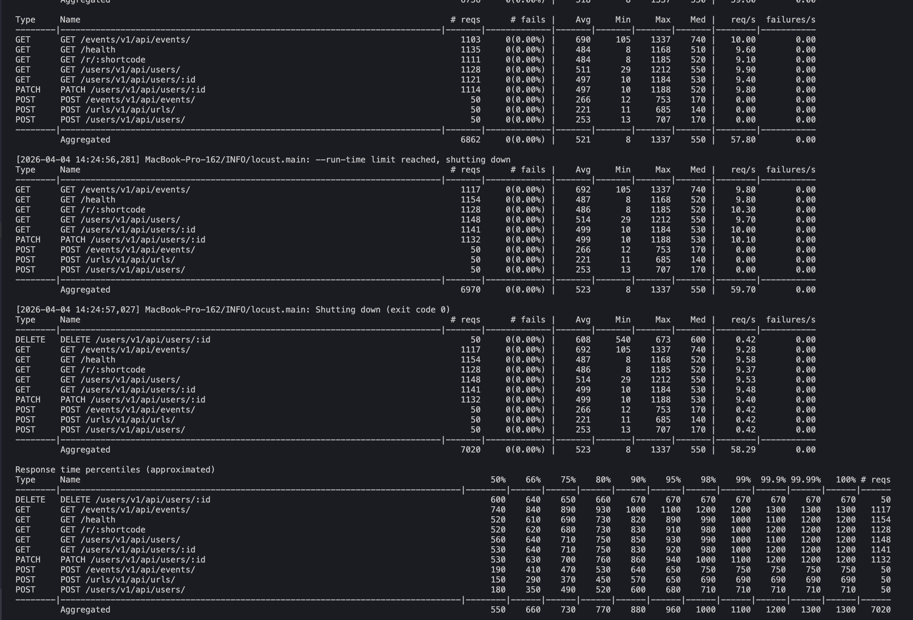

# Scalability

Scalability of GitRev is built upon it's kubenetes deployment. The application is designed to scale horizontally by adding more pods as load increases. The database is configured to handle a limited number of connections, and the application is optimized to minimize resource usage per request. The load testing strategy involves simulating concurrent users and measuring response times, error rates, and throughput to ensure the application can handle increased traffic while maintaining performance.

## Tier 1: Bronze

**Status:** Completed

**Objective:** Establish performance baseline under load.

**Main Objectives:**

- Load test with 50 concurrent users
- Document baseline response times (P95)
- Measure error rates
- Record throughput metrics

**Results:**

| Metric | Target | Actual |
|--------|--------|--------|
| Concurrent Users | 50 | 50 |
| P95 Response Time | < 1000ms | 960ms (aggregated) |
| Error Rate | < 1% | 0% |
| Throughput (req/s) | - | 58.09 |
| Total Requests | - | 6990 |
| Failed Requests | 0 | 0 |

**Test Run Date:** 2026-04-04  
**Test Duration:** 2m  
**Notes:** Tier 1 baseline passed with zero failures. The aggregated P95 met the target, while the slowest endpoint was `GET /events/v1/api/events/` at ~1100ms P95.

**Verification:**
- [CSV results file](../loadtest/results/tier1-baseline/tier1-50users_stats.csv)
- [Failures CSV](../loadtest/results/tier1-baseline/tier1-50users_failures.csv)
- [Exceptions CSV](../loadtest/results/tier1-baseline/tier1-50users_exceptions.csv)
- Screenshot: 

- Logs: 0 failures and 0 exceptions recorded in the tier1 baseline artifacts.

---

### Tier 2: Silver — The Scale-Out

**Status:** Not Started

**Objective:** Verify horizontal scaling with multiple instances.

**Main Objectives:**
- Load test with 200 concurrent users
- Deploy 2-4 instances of the application
- Configure load balancing between instances
- Maintain response times under 3 seconds

**Results:**

| Metric | Target | Actual |
|--------|--------|--------|
| Concurrent Users | 200 | - |
| Pods Running | 2-4 | - |
| P95 Response Time | < 3000ms | - |
| Error Rate | < 2% | - |
| Throughput (req/s) | - | - |
| Total Requests | - | - |
| Failed Requests | - | - |

**Test Run Date:** -  
**Test Duration:** -  
**HPA Scaling Behavior:** -  
**Load Balancer Configuration:** -  
**Notes:** -

**Verification:**
- CSV results file: -
- Pod scaling evidence: -
- Load distribution logs: -

---

### Tier 3: Gold — The Optimization

**Status:** Not Started

**Objective:** Handle 500+ concurrent users with optimization strategies.

**Main Objectives:**
- Load test with 500+ concurrent users
- Implement caching strategy
- Identify and document bottlenecks
- Maintain error rate under 5%

**Results:**

| Metric | Target | Actual |
|--------|--------|--------|
| Concurrent Users | 500+ | - |
| Success Rate | > 95% | - |
| P95 Response Time | < 500ms | - |
| Error Rate | < 5% | - |
| Throughput (req/s) | - | - |
| Total Requests | - | - |
| Failed Requests | - | - |
| Test with Caching | Yes | - |

**Test Run Date:** -  
**Test Duration:** -  
**Caching Implementation:** -  
**Peak Pod Count:** -  
**Database Connection Peak:** -  
**Notes:** -

**Bottleneck Analysis:**

Question: What was the primary bottleneck?  
Answer: -

Question: How was it fixed?  
Answer: -

Question: What performance improvements resulted?  
Answer: -

**Verification:**
- CSV results file (baseline): -
- CSV results file (with caching): -
- Performance comparison: -
- Caching implementation evidence: -
